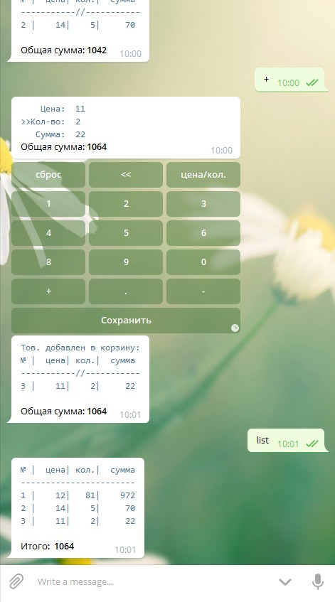

# spcart_bot
Telegram-бот корзина товаров (калькулятор)  

Позволяет быстро добавлять товары (цена, количество) и подсчитывать сумму.
Товары хранятся в базе данных MySQL, благодаря этому возможно начать подсчёт на одном устройстве, а закончить на другом. 

### h3 Установка
1. Скопируйте проект: git clone https://github.com/scriptfuture/spcart_bot.git
2. Получите токен у @BotFather
3. Зайдите в папку проекта: cd spcart_bot
4. Откройте файл spcart_bot.py с помошью текстовго редактора
5. Замените строку <YOUR_TOKEN> на ваш токен полученный у @BotFather
6. Установите вебсервер с MySQL (в  windows можно поставить, например, appserv.org)
7. Создайте базу данных spcart_bot (например через PHPMyAdmin)
8. Импортируйте файл spcart_bot.sql.gz в базу данных spcart_bot
9. В файле spcart_bot.py замените <user> <password> на ваши логин и пароль к базе данных:
   db = SPCB_DB('localhost', '<user>', '<password>', 'spcart_bot')
10. Установите зависимости: python -m pip install -r requirements.txt  (в windows можно запустить install.bat)
11. Запустите бота: python spcart_bot.py  (в windows можно запустить run.bat)

### h3 Основные команды
/new —  Добавить товар через форму (псевдоним: "+", "new")
/del — Удалить товар выбрав его из списка товаров (псевдоним: "-", "del")
/update — Редактировать товар выбрав его из списка товаров (псевдоним: "#", ""upd"","update", "/upd")
/list — Показать содержимое текущей корзины и итоговую сумму (псевдоним: "list")
/start — Вызов начального экрана (псевдоним: "/")
/newcart — Очистить текущую корзину и создать новую (псевдонимы: "*0", "newcart", "clean", "nc", "/clean", "/nc")
/cmd — Список всех доступных команд (псевдоним: "cmd")

### h3 Скриншот
